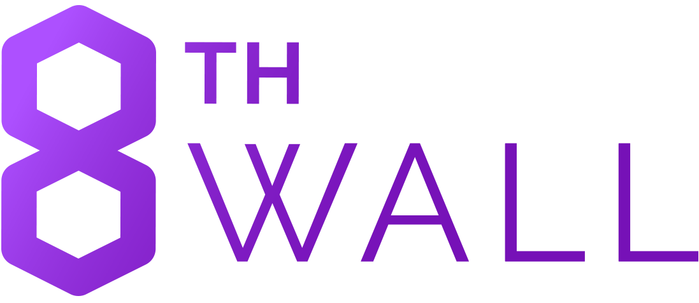

# MUN 8th Wall Web AR Boilerplate

This repo allows us to quickly and easily spin up an 8th Wall Three.js scene

## Development
1. Duplicate Repo
2. `npm i`
3. Create `.env` file in root
4. Add your 8th Wall App Key as `APP_8THWALL_API_KEY=YOURKEYHERE` to .env
5. Add `HTTPS=true` to .env
5. Run `npm run start`
6. Develop

## Production Build
_Coming Soon_

## Stack

* [Webpack](https://webpack.js.org/)
* [Postcss](https://postcss.org/)
* [Babel](https://babeljs.io/)
* [Three.js](http://threejs.org)
* [8th Wall](https://www.8thwall.com)
* [Tween.js](https://github.com/tweenjs/tween.js/)

## Todo:

* Add typescript support
* Move 8th wall to modules
* Add normalize.css
* Add css modules
